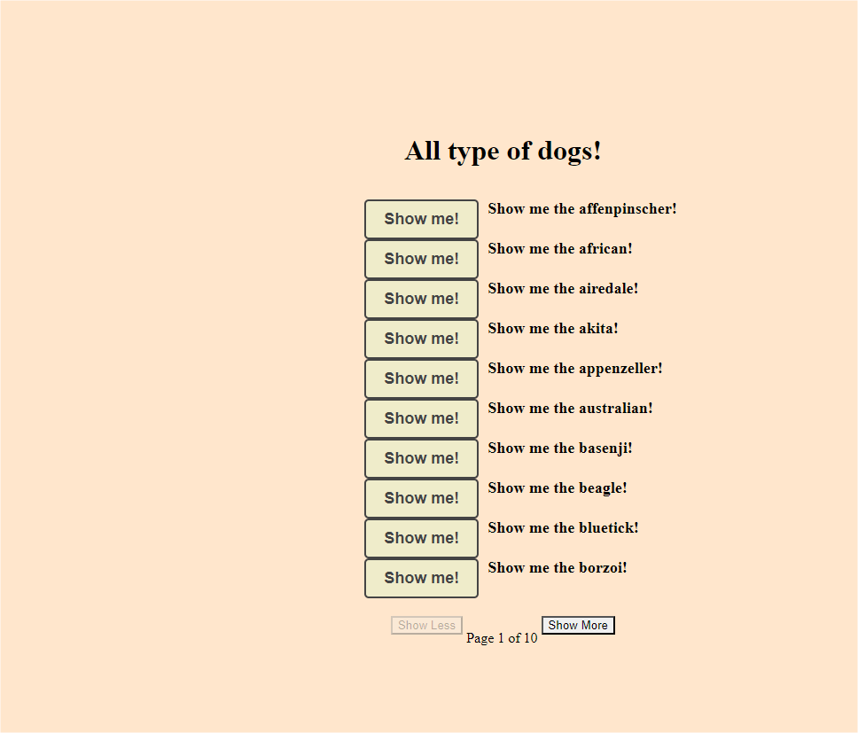

# dog-list-demo
<h1 align="center">
# Dog List
</h1>

## Screenshot

<div style="display: flex; flex-direction: 'row'; align-items: 'center';">
   
   
</div>

## 📥 How to run

```bash
# Clone the project:
$ git clone https://github.com/rebecagrn/fakeflix.git

# Install the dependencies
$ npm

# Run in browser
$ npm run dev

```

# :rocket: Features

- Display some dog breeds
- Show name of the breed + image
- Pagination + Responsive design

## 💻 Technologies and libraries

<ul>
  <li>NextJS</li>
  <li>Typescript</li>
  <li>React</li>
  <li>React Hooks</li>
  <li>Chakra-UI</li>
  <li>Dog CEO API</li>
</ul>

### Deployed in Vercel

[Click Here](https://fakeflix-iota.vercel.app/)

**By ❤ : [Rebeca](https://rebecadeveloper.netlify.app/)**
